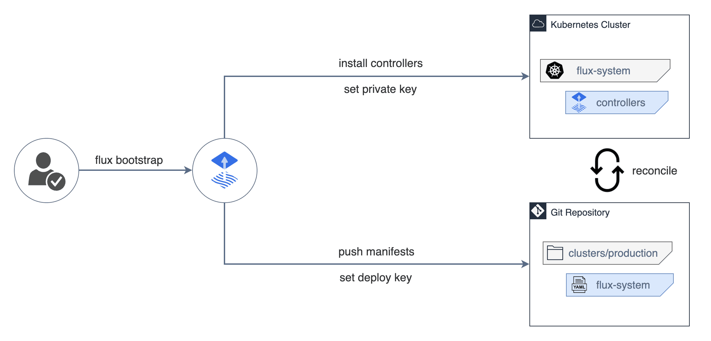

- [Funcionamento](#funcionamento)
- [Arquitetura](#arquitetura)
  - [Instalação](#instalação)
  - [Exporte suas credenciais](#exporte-suas-credenciais)
  - [Instale o Flux no seu cluster](#instale-o-flux-no-seu-cluster)
  - [Execute o comando bootstrap:](#execute-o-comando-bootstrap)
- [Clonar o repositório git](#clonar-o-repositório-git)
  - [Adicionar repositório podinfo ao Flux](#adicionar-repositório-podinfo-ao-flux)
  - [Implantar aplicativo podinfo](#implantar-aplicativo-podinfo)
  - [Assista ao Flux sincronizando o aplicativo](#assista-ao-flux-sincronizando-o-aplicativo)
  - [Suspender atualizações](#suspender-atualizações)
  - [Personalize a implantação do podinfo](#personalize-a-implantação-do-podinfo)
- [UI](#ui)
- [Desinstalando](#desinstalando)

# Funcionamento

O funcionamento do Flux se divide em:

1. Instalação do CLI

```bash
curl -s https://fluxcd.io/install.sh | sudo bash
```

2. Instalação do Flux

Para instalar no cluster no namespace flux-system, basta executar o comando

```bash
kubectl apply -f https://github.com/fluxcd/flux2/releases/latest/download/install.yaml
```

3. Bootstrap da aplicação

A reconciliação de aplicações é feita através do Kustomize que irá provisionar os recursos e também apagar caso remova o arquivo.

# Arquitetura

A segregação lógica se define pelo Kustomize, que são feitos através de `overlays` separados em pastas que irão provisionar o ambiente conforme necessário.




## Instalação

A [Documentação oficial](https://fluxcd.io/flux/get-started/) pode ser seguida na íntegra, mas de forma resumida temos os passos.

## Exporte suas credenciais

Exporte seu token de acesso pessoal e nome de usuário do GitHub:

```bash
export GITHUB_TOKEN=<your-token>
export GITHUB_USER=<your-username>
```

Verifique seu cluster Kubernetes
Verifique se você tem tudo o que é necessário para executar o Flux executando o seguinte comando:

```bash
flux check --pre
```

## Instale o Flux no seu cluster

Para obter informações sobre como fazer bootstrap usando uma organização GitHub, Gitlab e outros provedores git, consulte [Bootstrapping](https://fluxcd.io/flux/installation/bootstrap/)

## Execute o comando bootstrap:

```bash
flux bootstrap github \
  --owner=$GITHUB_USER \
  --repository=fleet-infra \
  --branch=main \
  --path=./clusters/my-cluster \
  --personal
```

O comando bootstrap acima faz o seguinte:

- Cria um repositório git fleet-infrana sua conta do GitHub.
- Adiciona manifestos de componentes Flux ao repositório.
- Implanta componentes do Flux no seu cluster do Kubernetes.
- Configura componentes do Flux para rastrear o caminho /clusters/my-cluster/no repositório

# Clonar o repositório git

Clone o `fleet-infra` repositório para sua máquina local:

```bash
git clone https://github.com/$GITHUB_USER/fleet-infra
cd fleet-infra
```

## Adicionar repositório podinfo ao Flux

Este exemplo usa um repositório público github.com/ivofulco/podinfo , podinfo é um pequeno aplicativo web feito com Go.

1. Crie um manifesto GitRepository apontando para a ramificação master do repositório podinfo:

```bash
flux create source git podinfo \
  --url=https://github.com/ivofulco/podinfo \
  --branch=master \
  --interval=1m \
  --export > ./clusters/my-cluster/podinfo-source.yaml
```

A saída é semelhante a:

```yaml
apiVersion: source.toolkit.fluxcd.io/v1
kind: GitRepository
metadata:
  name: podinfo
  namespace: flux-system
spec:
  interval: 1m
  ref:
    branch: master
  url: https://github.com/ivofulco/podinfo
```

2. Confirme e envie o `podinfo-source.yaml` arquivo para o `fleet-infra` repositório:

```bash
git add -A && git commit -m "Add podinfo GitRepository"
git push
```

## Implantar aplicativo podinfo

Configure o Flux para construir e aplicar o diretório kustomize localizado no repositório podinfo.

1. Use o comando `flux create` para criar uma Kustomization que aplique a implantação podinfo.

```bash
flux create kustomization podinfo \
  --target-namespace=default \
  --source=podinfo \
  --path="./kustomize" \
  --prune=true \
  --wait=true \
  --interval=30m \
  --retry-interval=2m \
  --health-check-timeout=3m \
  --export > ./clusters/my-cluster/podinfo-kustomization.yaml
```

A saída é semelhante a:

```yaml
apiVersion: kustomize.toolkit.fluxcd.io/v1
kind: Kustomization
metadata:
  name: podinfo
  namespace: flux-system
spec:
  interval: 30m0s
  path: ./kustomize
  prune: true
  retryInterval: 2m0s
  sourceRef:
    kind: GitRepository
    name: podinfo
  targetNamespace: default
  timeout: 3m0s
  wait: true
```

2. Confirme e envie o `Kustomization` manifesto para o repositório:

```bash
git add -A && git commit -m "Add podinfo Kustomization"
git push
```

A estrutura do fleet-infrarepositório deve ser semelhante a:

```bash
fleet-infra
└── clusters/
    └── my-cluster/
        ├── flux-system/                        
        │   ├── gotk-components.yaml
        │   ├── gotk-sync.yaml
        │   └── kustomization.yaml
        ├── podinfo-kustomization.yaml
        └── podinfo-source.yaml
```

## Assista ao Flux sincronizando o aplicativo

1. Use o comando `flux get` para observar o aplicativo podinfo.

```bash
flux get kustomizations --watch
```

A saída é semelhante a:

```bash
NAME          REVISION             SUSPENDED  READY   MESSAGE
flux-system   main@sha1:4e9c917f   False      True    Applied revision: main@sha1:4e9c917f
podinfo       master@sha1:44157ecd False      True    Applied revision: master@sha1:44157ecd
```

2. Verifique se o podinfo foi implantado no seu cluster:

```bash
kubectl -n default get deployments,services
```

A saída é semelhante a:

```bash
NAME                      READY   UP-TO-DATE   AVAILABLE   AGE
deployment.apps/podinfo   2/2     2            2           108s

NAME                 TYPE        CLUSTER-IP       EXTERNAL-IP   PORT(S)             AGE
service/podinfo      ClusterIP   10.96.0.1   <none>        9898/TCP,9999/TCP   108s
```

As alterações feitas nos manifestos podinfo do Kubernetes na ramificação master são refletidas no seu cluster.

Quando um manifesto do Kubernetes é removido do repositório podinfo, o Flux o remove do seu cluster. Quando você exclui um `Kustomization` do repositório `fleet-infra`, o Flux remove todos os objetos do Kubernetes aplicados anteriormente daquele `Kustomization`.

Quando você altera a implantação do podinfo usando `kubectl edit`, as alterações são revertidas para corresponder ao estado descrito no Git.

## Suspender atualizações

Suspender atualizações de uma personalização permite que você edite diretamente objetos aplicados de uma personalização, sem que suas alterações sejam revertidas pelo estado no Git.

Para suspender atualizações de uma personalização, execute o comando `flux suspend kustomization flux-system`

Para retomar as atualizações, execute o comando `flux resume kustomization flux-system`

Para forçar a reconciliação, execute o comando `flux reconcile kustomization flux-system --with-sourced`

## Personalize a implantação do podinfo

Para personalizar uma implantação de um repositório que você não controla, você pode usar patches in-line do Flux . O exemplo a seguir mostra como usar patches in-line para alterar a implantação do podinfo.

1. Adicione o seguinte ao campo specdo seu podinfo-kustomization.yamlarquivo:

```yaml
  patches:
    - patch: |-
        apiVersion: autoscaling/v2
        kind: HorizontalPodAutoscaler
        metadata:
          name: podinfo
        spec:
          minReplicas: 3             
      target:
        name: podinfo
        kind: HorizontalPodAutoscaler
```

2. Confirme e envie as podinfo-kustomization.yamlalterações:

```bash
git add -A && git commit -m "Increase podinfo minimum replicas"
git push
```

Após a conclusão da sincronização, a execução `kubectl get pods` deverá exibir 3 pods.

# UI

Por padrão o FluxCD não possui interface gráfica, porém através de outras ferramentas, como por exemplo o [Capacitor](https://fluxcd.io/blog/2024/02/introducing-capacitor/) e o [Weave](https://github.com/weaveworks/weave-gitops).


# Desinstalando

Para remover o flux é possível fazer de 2 formas diferentes, conforme apresentado nos comandos abaixo:

```bash
flux uninstall --namespace=flux-system ; kubectl delete namespace flux-system
```
